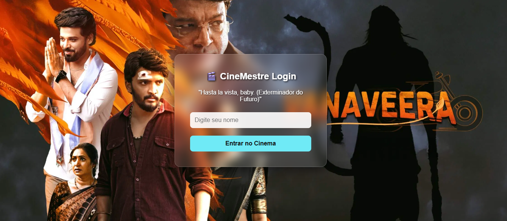

# 🎬 CineMestre - Interface de Cinema Dinâmica


O CineMestre é uma aplicação Full Stack que oferece uma experiência imersiva de login, com planos de fundo e frases que mudam dinamicamente consumindo dados reais do cinema.

## 🚀 Tecnologias
- **Frontend:** HTML5, CSS3, JavaScript (ES6+)
- **Backend:** Node.js, Express
- **APIs:** The Movie Database (TMDB) para imagens e API interna para frases.
- **Segurança:** Dotenv para proteção de chaves de API.

## 📁 Estrutura do Projeto
O projeto utiliza uma arquitetura de Monorepo organizada da seguinte forma:
- `/frontend`: Contém toda a interface do usuário (HTML, CSS, JS do cliente).
- `/backend`: Servidor Node.js, rotas da API e configurações de ambiente.

## 🛠️ Como rodar o projeto localmente

### 1. Pré-requisitos
Você precisará do [Node.js](https://nodejs.org/) instalado em sua máquina.

### 2. Configuração do Backend
Abra o terminal na raiz do projeto e siga os passos:

```bash
# Entre na pasta do servidor
cd backend

# Instale as dependências
npm install

# Crie um arquivo chamado .env na pasta /backend e adicione sua chave do TMDB:
# TMDB_KEY=sua_chave_aqui

### 3. Iniciando o Servidor
Ainda dentro da pasta /backend, execute:
node server.js

O servidor iniciará em http://localhost:3000.
